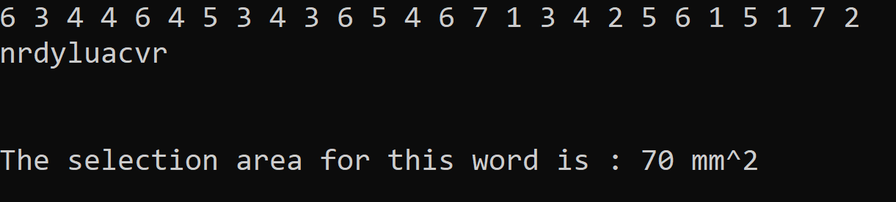
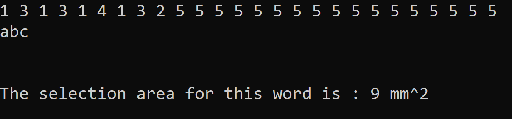
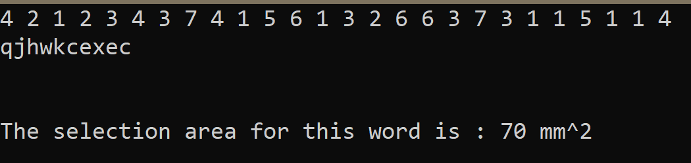

# Designer-PDF-Viewer

<i><b>Uzunuluğu 26 olan h dizisine harfler denk gelecek şekilde yazılıyor ve her harfin alfabedeki indisi, h dizisindeki indislerine gelen sayılar bir deger dizisine aktarlıyor ve en büyük değer word değişkeninin uzunluğu ile çarpılıyor.</b></i>

 
 
 
